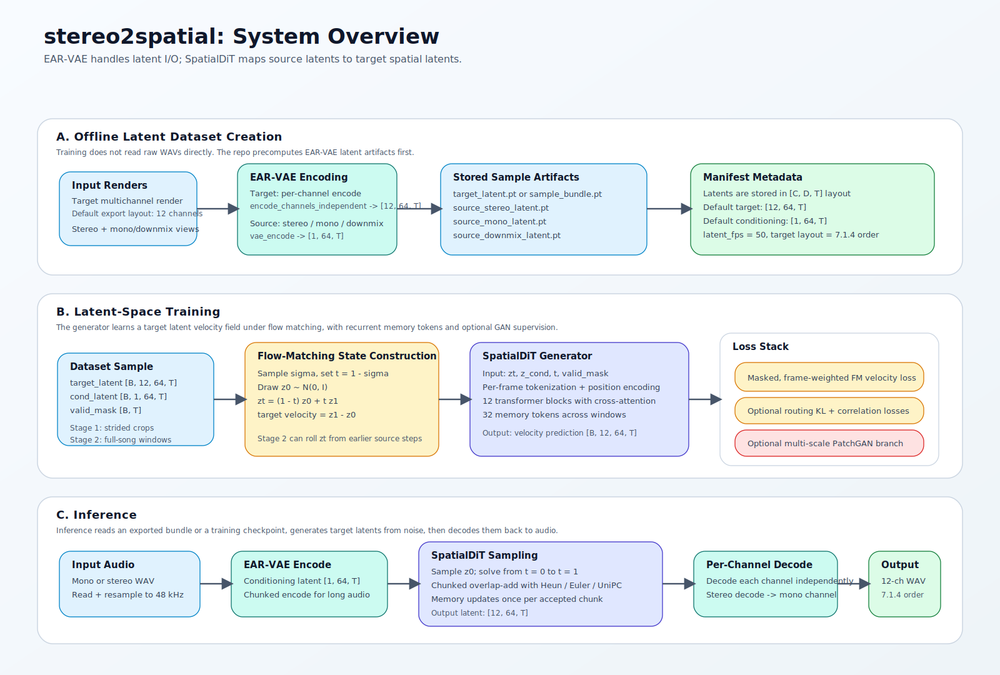
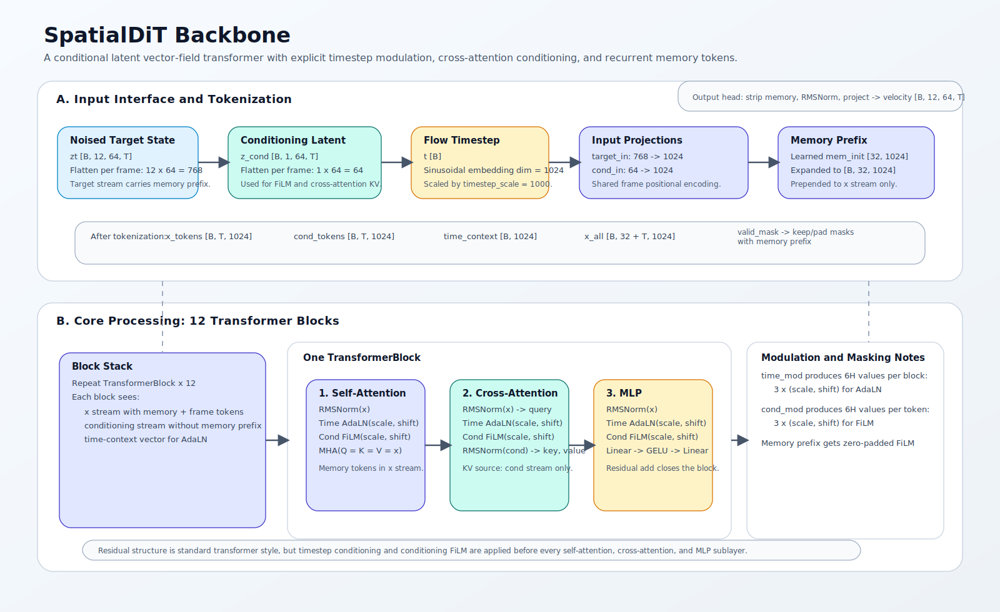

# stereo2spatial Architecture

This document is an architecture reference for the current
`stereo2spatial` implementation.

Core implementation files:

- `stereo2spatial/modeling/spatial_dit.py`
- `stereo2spatial/modeling/layers.py`
- `stereo2spatial/training/losses_windowed.py`
- `stereo2spatial/training/losses_batch.py`
- `stereo2spatial/training/losses_full_song.py`
- `stereo2spatial/training/scheduled_sampling.py`
- `stereo2spatial/training/discriminator.py`
- `stereo2spatial/inference/sampling.py`
- `stereo2spatial/codecs/ear_vae/codec.py`

The current model is best described as a conditional latent flow-matching
transformer with recurrent memory tokens, trained in EAR-VAE latent space.

## Figures

### Figure 1. End-to-end system overview

> Overview of the stereo2spatial pipeline. Audio is encoded into an EAR-VAE
> latent space, a conditional SpatialDiT predicts a target latent vector field,
> and the generated multichannel latents are decoded channel-wise back to the
> output speaker layout.

### Figure 2. SpatialDiT backbone

> SpatialDiT operates on per-frame latent tokens. Target-state tokens and
> conditioning tokens receive separate input projections and shared positional
> embeddings, while a timestep MLP provides block-wise AdaLN modulation. A
> learned recurrent memory prefix is threaded only through the target stream.

## High-level Summary

At a high level, the repo has three layers:

1. `EAR-VAE` is the codec layer.
   It maps waveform audio into a compact latent sequence and decodes latents
   back to audio.
2. `SpatialDiT` is the generator.
   It predicts a latent velocity field that transforms noise into a spatial
   target latent conditioned on a mono or stereo source latent.
3. The training stack wraps this with flow-matching supervision, long-context
   windowing, optional scheduled sampling, optional EMA, and optional GAN loss.

## Latent Interface

The repo trains entirely on precomputed latent artifacts. Dataset preparation
encodes:

- the target multichannel render channel-by-channel with
  `encode_channels_independent`, producing `target_latent` in `[C, D, T]`
  layout
- stereo, mono, and AC3-style downmix conditioning signals with `vae_encode`,
  producing single-stream conditioning latents in the same `[C, D, T]` layout

With the default configs:

| Tensor | Meaning | Default shape |
| --- | --- | --- |
| `target_latent` | Spatial target latent | `[12, 64, T]` |
| `source_stereo_latent` | Stereo conditioning latent | `[1, 64, T]` |
| `source_mono_latent` | Mono conditioning latent | `[1, 64, T]` |
| `source_downmix_latent` | AC3-style downmix latent | `[1, 64, T]` |
| `valid_mask` | Valid non-padding frames | `[T]` or batched `[B, T]` |

The default 12-channel export order is:

`FL, FR, FC, LFE, BL, BR, SL, SR, TFL, TFR, TBL, TBR`

## SpatialDiT Backbone

`SpatialDiT` predicts a latent velocity field from a noised target latent state
`zt`, a conditioning latent `z_cond`, and a scalar timestep `t`.

### Inputs and tokenization

The model consumes:

- `zt`: `[B, C_target, D_latent, T]`
- `z_cond`: `[B, C_cond, D_latent, T]`
- `t`: `[B]`
- optional `valid_mask`: `[B, T]`
- optional recurrent memory: `[B, M, H]`

Per frame, the channel and latent dimensions are flattened:

- target token width = `target_channels * latent_dim`
- conditioning token width = `cond_channels * latent_dim`

Under the default config:

- target token width = `12 * 64 = 768`
- conditioning token width = `1 * 64 = 64`
- hidden width = `1024`

Two separate linear projections lift the target and conditioning streams into
the common transformer hidden space:

- `target_in: 768 -> 1024`
- `cond_in: 64 -> 1024`

Sinusoidal positional embeddings are then added to both frame-token streams.

### Timestep conditioning

The flow timestep `t` is embedded with a sinusoidal embedding, scaled by
`timestep_scale` and passed through a two-layer MLP:

- sinusoidal timestep embedding: `dim = 1024`
- time MLP: `1024 -> 4096 -> 1024`

The resulting vector is not appended as another token. Instead, each
transformer block converts it into six modulation vectors:

- `(scale, shift)` for self-attention pre-norm
- `(scale, shift)` for cross-attention pre-norm
- `(scale, shift)` for MLP pre-norm

This is effectively timestep-conditioned AdaLN over the target stream.

### Recurrent memory tokens

The model optionally prepends learned memory tokens to the target stream.

Important implementation details:

- memory tokens are part of the `x` stream only
- they are initialized from a learned parameter `mem_init`
- conditioning FiLM parameters are zero-padded across memory positions
- memory is threaded window-to-window in both long-context training and
  chunked inference

With the default config:

- `num_memory_tokens = 32`
- memory tensor shape = `[B, 32, 1024]`

This is the main long-context mechanism in the backbone.

### Transformer block structure

Each block contains three residual sublayers:

1. self-attention on the target stream
2. cross-attention from target queries into conditioning keys/values
3. MLP

The modulation pattern is the same for each sublayer:

1. `RMSNorm`
2. timestep AdaLN
3. conditioning FiLM
4. sublayer computation
5. residual add

The conditioning stream is used in two ways:

- directly, as the KV source for cross-attention
- indirectly, by producing per-token FiLM parameters with `cond_mod`

That means the conditioning latent shapes both the attention content and the
block-wise feature modulation.

### Output head

After the final block:

- target tokens are separated from the memory-token prefix
- the remaining frame tokens go through `RMSNorm`
- a final linear layer projects them back to the flattened target latent width
- the tensor is reshaped back to `[B, C_target, D_latent, T]`

The output is a velocity prediction, not a denoised sample directly.

## Flow-matching Objective

Training follows a latent flow-matching formulation.

For each sample:

- sample a sigma value
- set `t = 1 - sigma`
- draw Gaussian noise `z0`
- form the interpolated state `zt = (1 - t) z0 + t z1`
- set the velocity target to `z1 - z0`

The model is trained to predict that target velocity under a masked,
frame-weighted MSE loss.

Window overlap is handled with deterministic overlap weights so longer
sequences can be processed in fixed-size windows without discontinuous loss
boundaries.

## Long-context Training

The repo has two distinct training regimes.

| Regime | Configs | Sequence mode | Default batch size | Main purpose |
| --- | --- | --- | --- | --- |
| Stage 1 | `train.yaml`, `train_with_gan.yaml` | `strided_crops` | `8` or `4` | Short-context bootstrap |
| Stage 2 | `train_stage_2.yaml`, `train_with_gan_stage_2.yaml` | `full_song` | `1` | Long-context refinement |

### Stage 1

Stage 1 uses randomized crop lengths and strided sampling. It teaches the
backbone the basic stereo-to-spatial latent mapping without forcing the model
to roll out through long sequences.

### Stage 2

Stage 2 switches to full-song mode and retains fixed-size internal windows.

## Scheduled Sampling and ReflexFlow

When enabled, stage 2 can replace the clean interpolated state `zt` with a
model-rolled state produced from an earlier source timestep.

The rollout implementation supports:

- `euler`
- `heun`
- `unipc`

Important implementation detail:

- memory is kept fixed during provisional solver substeps
- memory is only committed after an accepted window result

This avoids contaminating the recurrent state with intermediate solver probes.

The code also supports a `ReflexFlow` option, which adds exposure-aware
reweighting and a directional anti-drift penalty.

## Auxiliary Structure Losses

The training stack optionally applies two additional latent-space regularizers
to the reconstructed target estimate:

- routing KL:
  matches the per-`(latent_dim, time)` energy distribution across output
  channels
- correlation loss:
  matches the off-diagonal cross-channel structure between predicted and target
  outputs

These losses operate on:

`x1_hat = zt + (1 - t) * velocity_prediction`

So they regularize the predicted target reconstruction, not the raw velocity
tensor directly.

## Adversarial Branch

GAN training is optional and uses a latent-space multi-scale PatchGAN.

Discriminator input is the concatenation of:

- conditioning latent
- real or fake target latent estimate
- optional mask channel

Two discriminator branches run in parallel:

- `fine`: time-focused detail modeling
- `coarse`: time and latent-frequency downsampling for broader structure

Losses:

- discriminator hinge loss
- generator hinge loss
- optional R1 penalty on the real branch

The adversarial term is warmed in over `gan_adv_warmup_steps` so training does
not become discriminator-dominated too early.

## Inference Path

Inference mirrors training conceptually but runs as ODE-style generation from
noise to target latent.

Steps:

1. Read mono or stereo input waveform.
2. Encode it with EAR-VAE into a conditioning latent `[1, 64, T]`.
3. Sample Gaussian target noise `z0`.
4. Solve the latent vector field from `t=0` to `t=1` in overlap-add chunks.
5. Decode each predicted target channel latent independently with EAR-VAE.
6. Reduce each decoded stereo result back to a mono waveform channel and stack
   them into the final multichannel waveform.